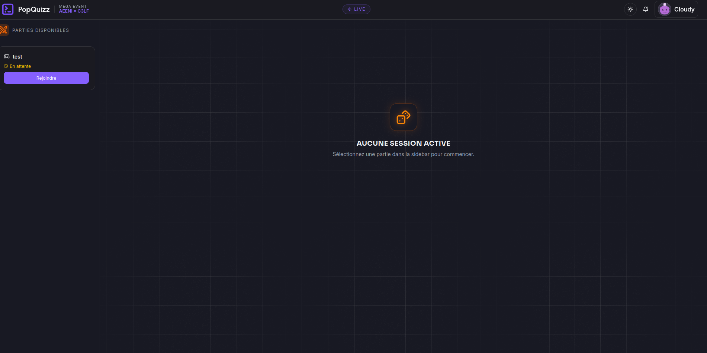
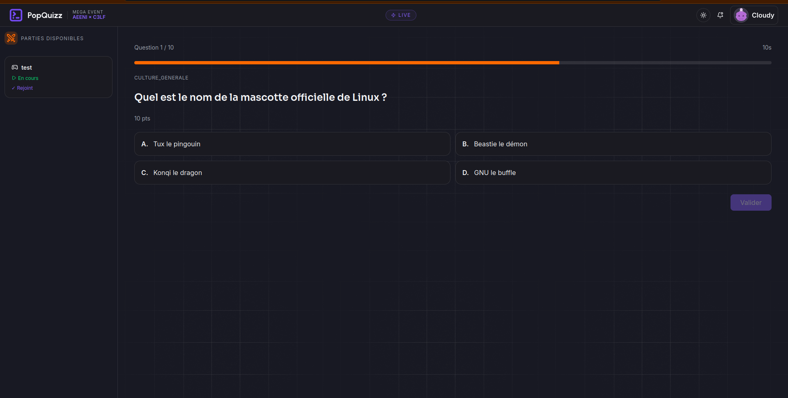
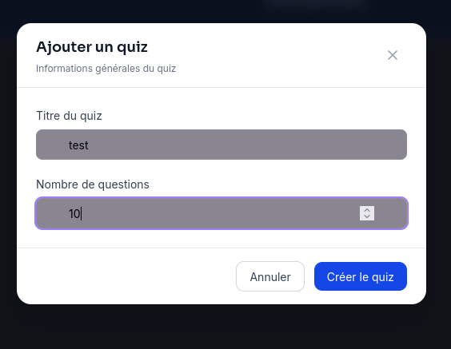
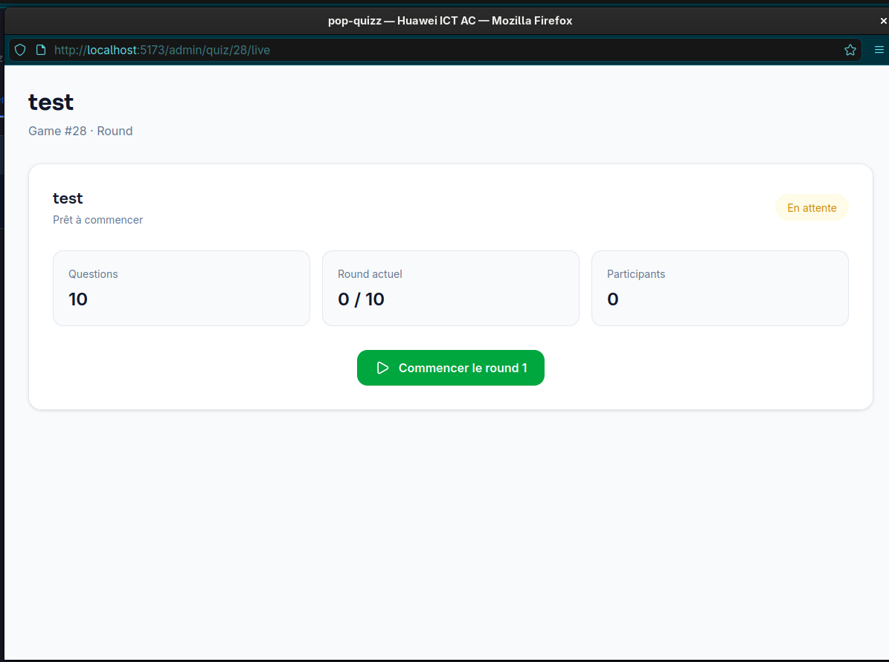
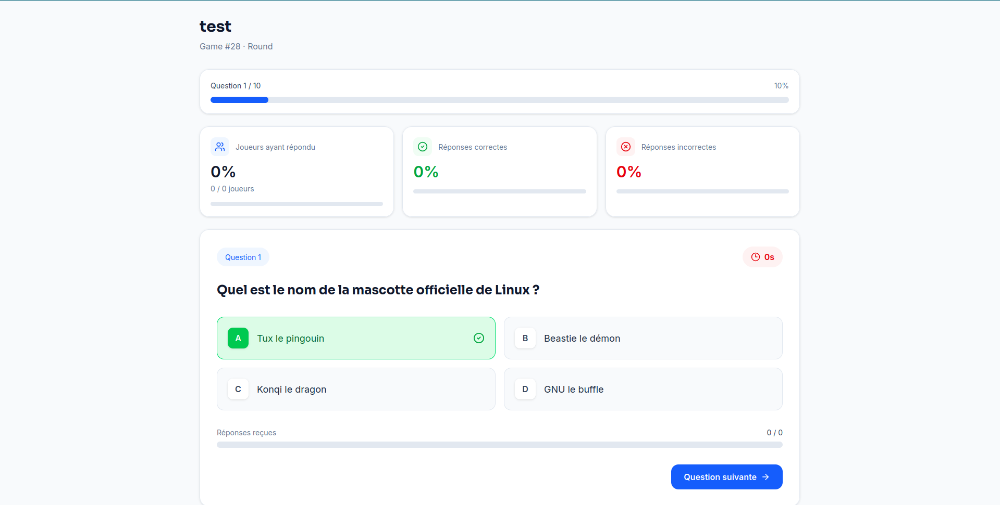

# Pop-Quizz Linux — Frontend

Application de quiz en temps réel sur le thème Linux (commandes, shell, culture générale), avec gestion multi-joueurs, classement live et statistiques administrateur.

## Stack technique

React, Tailwind CSS, TanStack Query, Axios, Socket.io-client, Framer Motion, Shadcn UI (cf. [documentation.md](./documentation.md) pour le détail complet).

## Structure du projet

Voir la section **Architecture des fichiers et dossiers** dans [documentation.md](./documentation.md#1-architecture-des-fichiers-et-dossiers-src).

## Conventions

Voir la section **Conventions de nommage** dans [documentation.md](./documentation.md#3-conventions-de-nommage).

## Gestion des flux de données (HTTP & WebSocket)

Voir la section **Stratégie de gestion réseau et flux de données** dans [documentation.md](./documentation.md#4-stratégie-de-gestion-réseau-et-flux-de-données).

## Fonctionnalités :

_(veuillez lister ici bas les fonctionnalités déjà ajouter)_

## Documentation

Le détail technique complet (architecture, stack, conventions, flux HTTP/WebSocket) se trouve dans [`documentation.md`](./documentation.md).

## Aperçu de l'interface

### Interface joueur

| Liste des parties                                                                                                  | Question du quiz                                                                                               |
| ------------------------------------------------------------------------------------------------------------------ | -------------------------------------------------------------------------------------------------------------- |
|  |  |

### Interface administrateur

| Création d'une partie                                                                                                          | Démarrage d'une partie                                                                                                         |
| ------------------------------------------------------------------------------------------------------------------------------ | ------------------------------------------------------------------------------------------------------------------------------ |
|  |  |

| Gestion des questions                                                                                                    |
| ------------------------------------------------------------------------------------------------------------------------ |
|  |
